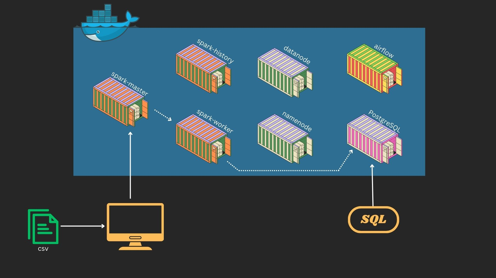

# AIRBNB LISTINGS ETL (LOCAL DEVELOPMENT AND DEPLOYMENT OF ETL)



(LINK) [Youtube Tutorial to understand this project](https://youtu.be/-4YADNVYqJk?si=k8-tYNMNBXu94yhr)

## Overview
This project aims to build an ETL pipeline to transform raw Airbnb listings data into a structured format for price and availability analysis. The raw data is often messy, contains missing values, and is inefficient for querying business insights. 

### Why Are We Building This Pipeline?
Airbnb generates large volumes of listings data, but raw data:
- Is messy (missing values, inconsistent formats, redundant columns).
- Cannot be queried efficiently for business insights.
- Needs transformation to extract meaningful insights.

### Business Questions We Want to Answer:
- What are the average prices of Airbnb listings per neighborhood?
- Which areas have the highest number of available listings?
- What is the price distribution of different property types (entire home, private room, etc.)?
- Which hosts have the most listings?

## Technologies Used
- **Apache Spark:** For distributed data processing.
- **HDFS:** To store and distribute data across nodes.
- **PostgreSQL:** To store transformed data for analysis.
- **Airflow:** To orchestrate and automate the ETL pipeline.
- **Docker & Docker-Compose:** To containerize the environment.

## Setup Instructions
### Prerequisites
Ensure you have the following installed:
- Docker & Docker Compose
- PostgreSQL
- Apache Spark
- Apache Airflow

**To understand and set-up docker environment locally visit my repo for detailed understanding (https://github.com/yash-chauhan-dev/SPARK_HDFS_AIRFLOW_CLUSTER_DOCKER)**

### Running the script
1. Clone the repository:
   ```bash
   git clone https://github.com/yash-chauhan-dev/ETL_AIRBNB_LISTING.git
   cd ETL_AIRBNB_LISTING
   ```
2. Start the Docker environment:
   ```bash
   docker-compose up -d
   ```
3. Copy file to spark master
   ```bash
   docker cp ./scripts <spark_master_container>:/opt/spark/app/
   docker cp ./config <sparrk_master_container>:/opt/spark/app/
   ```

4. Put the data into HDFS (For now consider it as a storage accessable by all spark nodes)
   ```bash
   docker cp ./data <namenode_container>:./
   hadoop exec -it <namenode_container> hadoop fs -mkdir /user_data
   docker exec -it <namenode_container> hadoop fs -put /data /user_data/
   ```
4. Submit the ETL job to Spark:
   ```bash
   docker exec -it <spark_master_container> spark-submit /opt/spark/app/scripts/etl.py
   ```

## Issues Faced & Solutions
### Issue: Data Directory Not Found
**Problem:** When submitting the Spark job to the cluster, the worker nodes couldn’t access the data directory mounted on the master node.

**Solution:** Used HDFS to store data, ensuring both master and worker nodes have access.


## Business Questions (SQL):
- What are the average prices of Airbnb listings per neighborhood?
```bash
SELECT 
   neighbourhood, 
   ROUND(AVG(price)::numeric,2) as average_price 
FROM airbnb_listings 
GROUP BY neighbourhood;
```
- Which areas have the highest number of available listings?
```bash
SELECT 
   neighbourhood, 
   COUNT(*) as listings 
FROM airbnb_listings 
GROUP BY neighbourhood
ORDER BY listings desc;
```
- What is the price distribution of different property types (entire home, private room, etc.)?
```bash
SELECT 
   room_type, 
   ROUND(AVG(price)::numeric,2) as average_price 
FROM airbnb_listings 
GROUP BY room_type
ORDER BY average_price desc;
```
- Which hosts have the most listings?
```bash
SELECT 
   host_id,
   host_name, 
   COUNT(*) as listings 
FROM airbnb_listings 
GROUP BY host_id, host_name
ORDER BY listings desc
LIMIT 1;
```

## Future Enhancements
- Automate the ETL pipeline with Airflow scheduling.
- Integrate additional data sources for enriched insights.
